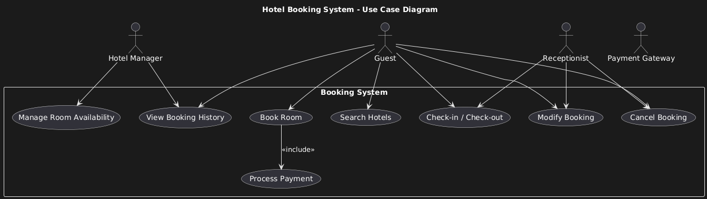

# Requirement Analysis in Software Development

This repository serves as a collaborative space to document and reflect on our understanding of requirement analysis in software development. It captures key concepts, techniques, and insights we've gathered, aiming to deepen our grasp of how effective requirement gathering shapes successful software projects.

---

## What is Requirement Analysis?

Requirement analysis is a fundamental phase in the software development lifecycle (SDLC) that involves identifying, gathering, analyzing, and documenting the needs and expectations of stakeholders for a software system. This process bridges the gap between business goals and technical implementation, ensuring that the final product aligns with user needs and project objectives.

During requirement analysis, developers, analysts, and stakeholders collaborate to answer key questions such as:
- What problem are we trying to solve?
- Who will use the system, and how?
- What features and constraints must the system accommodate?

### Importance in the SDLC

Requirement analysis is crucial because it lays the groundwork for all subsequent development activities. Here's why it matters:
- **Reduces ambiguity:** Clear, well-defined requirements prevent misunderstandings and scope creep later in the project.
- **Improves design quality:** Accurate requirements lead to better architecture and user experience decisions.
- **Minimizes rework and cost:** Catching issues early saves time and budget compared to fixing them during or after development.
- **Aligns stakeholders:** Everyone—from clients to developers—gets a shared understanding of what success looks like.

In short, requirement analysis transforms abstract ideas into actionable insights, enabling teams to build software that actually solves the right problems.

---

## Why is Requirement Analysis Important?

Requirement analysis is not just a preliminary step—it's the backbone of successful software development. Here are three key reasons why it's critical in the Software Development Lifecycle (SDLC):

### 1. Prevents Miscommunication and Scope Creep

By thoroughly understanding what stakeholders expect and documenting those expectations clearly, requirement analysis ensures that everyone—from developers to clients—is on the same page. This reduces the risk of misunderstood goals and prevents scope creep, where unplanned features sneak into the project and derail timelines.

### 2. Enhances Project Planning and Resource Allocation

Well-defined requirements provide a solid foundation for estimating time, budget, and manpower. With a clear understanding of the project's scope, teams can create more accurate plans, assign appropriate resources, and set realistic deadlines, reducing the likelihood of last-minute chaos.

### 3. Improves Product Quality and User Satisfaction

When requirements are aligned with user needs, the resulting software is far more likely to be functional, user-friendly, and impactful. Good analysis means fewer reworks, better testing alignment, and ultimately, a product that truly solves the right problems.

---

## Key Activities in Requirement Analysis

Effective requirement analysis involves a sequence of collaborative and analytical activities that shape the foundation of a software project. Here are the five core activities:

- **Requirement Gathering**  
  This is the process of collecting all potential requirements from stakeholders such as clients, users, and domain experts. It sets the groundwork by identifying what the system must accomplish.

- **Requirement Elicitation**  
  Goes deeper than gathering—elicitation involves actively engaging with stakeholders through interviews, surveys, workshops, and observation to uncover hidden needs, constraints, and priorities.

- **Requirement Documentation**  
  Capturing the gathered and elicited information in clear, structured formats like Software Requirement Specifications (SRS), user stories, or use cases. Good documentation ensures traceability and serves as a reference for design and testing.

- **Requirement Analysis and Modeling**  
  Involves refining and categorizing the requirements, checking for completeness, consistency, and feasibility. Techniques like data flow diagrams, UML models, or user journey mapping are often used here.

- **Requirement Validation**  
  The final step ensures that the documented requirements truly reflect stakeholder intentions. This can involve reviews, walkthroughs, and formal approval processes, helping to catch errors early and align expectations.

## Types of Requirements

In software development, requirements are generally categorized into two main types: **Functional Requirements** and **Non-functional Requirements**. Both are essential for building a robust and user-centric system. Below are definitions and examples specific to a hotel booking management system.

### Functional Requirements

Functional requirements define what the system should do—its core features and behaviors. These are directly tied to user interactions and business logic.

**Examples for the Booking Management Project:**
- **User Registration and Authentication:** Users should be able to sign up, log in, and manage their profiles securely.
- **Search and Filter Hotels:** Users can search for hotels based on location, price, availability, and amenities.
- **Room Booking:** Users can select a room, choose check-in/check-out dates, and confirm a reservation.
- **Payment Integration:** The system should support secure online payments via credit/debit cards or digital wallets.
- **Booking History:** Users can view, modify, or cancel their past and upcoming bookings.

### Non-functional Requirements

Non-functional requirements describe how the system performs rather than what it does. They focus on quality attributes like performance, security, and usability.

**Examples for the Booking Management Project:**
- **Performance:** The system should return hotel search results within 2 seconds under normal load.
- **Scalability:** The platform must support up to 100,000 concurrent users during peak travel seasons.
- **Security:** All sensitive data, including payment details and personal information, must be encrypted and comply with GDPR.
- **Availability:** The system should maintain 99.9% uptime to ensure continuous access for users and hotel partners.
- **Usability:** The interface should be intuitive and accessible, supporting both desktop and mobile users with responsive design.

---

## Use Case Diagrams

Use Case Diagrams are a type of Unified Modeling Language (UML) diagram that visually represent the interactions between users (actors) and a system. They help illustrate the system’s functionality from the user's perspective, showing what the system does rather than how it does it.

### Benefits of Use Case Diagrams

- **Clarify System Scope:** They define what is inside and outside the system boundary, helping teams focus on relevant features.
- **Improve Communication:** Use Case Diagrams provide a simple, visual way to communicate requirements with both technical and non-technical stakeholders.
- **Support Planning and Testing:** They serve as a foundation for identifying test cases and planning development tasks.

### Use Case Diagram for the Booking System

The diagram below illustrates the primary actors and use cases for a hotel booking system inspired by platforms like Airbnb and OYO.

**Actors:**
- Guest
- Receptionist
- Hotel Manager
- Payment Gateway

**Use Cases:**
- Search Hotels
- Book Room
- Modify Booking
- Cancel Booking
- Check-in / Check-out
- Process Payment
- Manage Room Availability
- View Booking History

